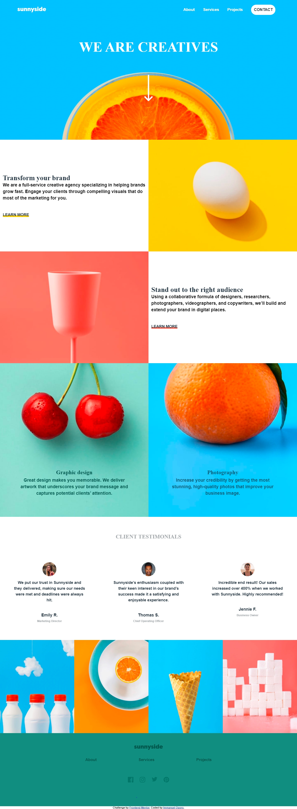

# Frontend Mentor - Sunnyside agency landing page solution

This is a solution to the
[Sunnyside agency landing page challenge on Frontend Mentor](https://www.frontendmentor.io/challenges/sunnyside-agency-landing-page-7yVs3B6ef).
Frontend Mentor challenges help you improve your coding skills by building
realistic projects.

## Table of contents

- [Overview](#overview)
  - [The challenge](#the-challenge)
  - [Screenshot](#screenshot)
  - [Links](#links)
- [My process](#my-process)
  - [Built with](#built-with)
  - [What I learned](#what-i-learned)
  - [Continued development](#continued-development)
  - [Useful resources](#useful-resources)
- [Author](#author)
- [Acknowledgments](#acknowledgments)

## Overview

### The challenge

Users should be able to:

- View the optimal layout for the site depending on their device's screen size
- See hover states for all interactive elements on the page

### Screenshot

 \

### Links

- Solution URL: [Add solution URL here](https://your-solution-url.com)
- Live Site URL: [Add live site URL here](https://your-live-site-url.com)

## My process

### Built with

- Semantic HTML5 markup
- CSS custom properties
- Flexbox
- CSS Grid
- Mobile-first workflow
- SASS

### What I learned

i learnt how to make use of sprite files to better optimize my html workflow. i
also learnt how to make responsive navigation bars although with the desktop
first approach still trying to figure how to do it with the mobile first
approach.

### Useful resources

- [Example resource 1](https://www.creativebloq.com/features/the-complete-guide-to-svg/6) -
  This helped me on how to make use of sprite files . I really liked this
  pattern and will use it going forward.
- [Example resource 2](https://bennettfeely.com/clippy/) - This is an
  amazingtool which helped me save time when creating the clip path for the menu
  navigation
